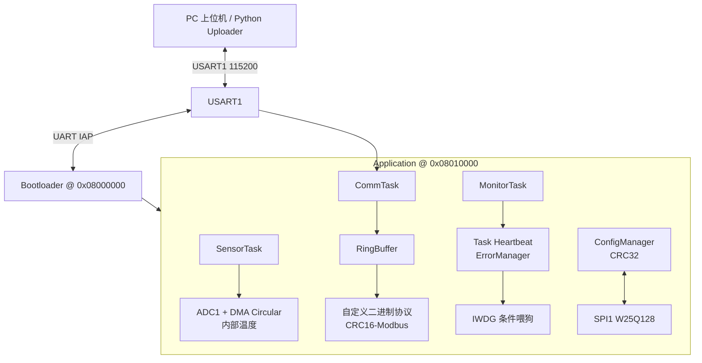
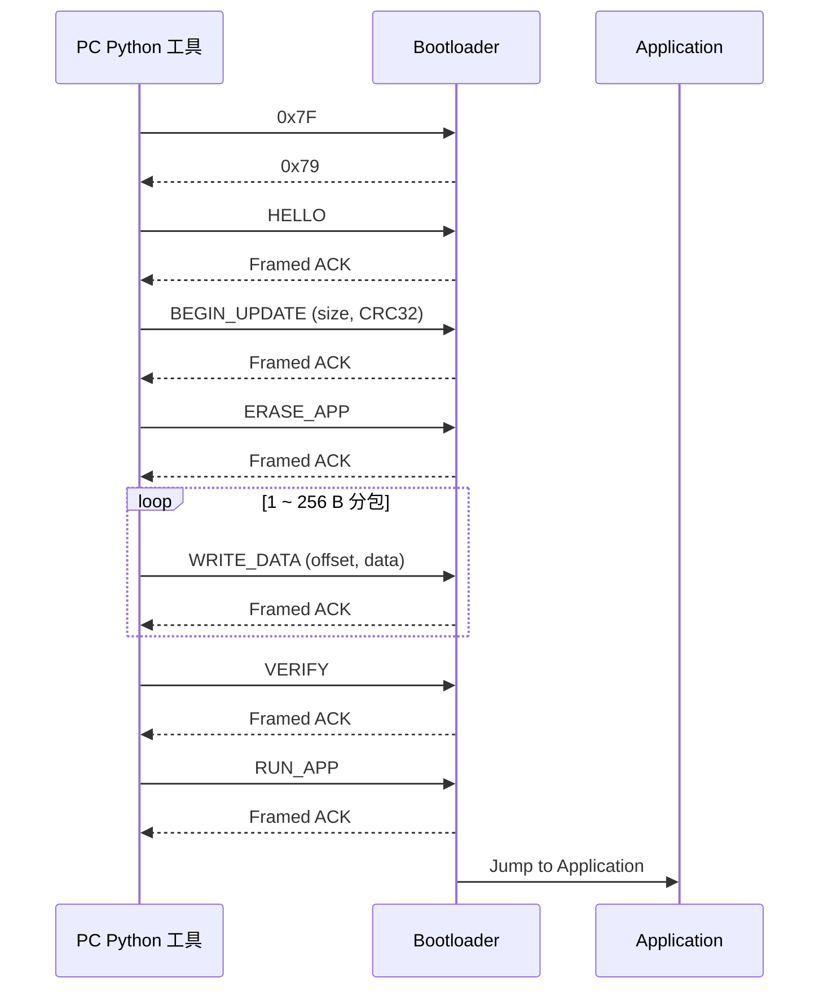

# STM32F407 Industrial Monitor

基于 STM32F407 与 FreeRTOS 的工业数据采集与监控终端。项目聚焦嵌入式系统常见的采集、通信、配置持久化、运行健康监控与现场升级链路，面向嵌入式软件岗位作品展示。

## 1. 项目简介

目标硬件为 STM32F407ZGT6，系统时钟 168 MHz，使用 STM32 HAL 与 FreeRTOS。应用侧负责温度采集、USART 通信、配置管理和任务健康监控；独立 Bootloader 位于 Flash 起始地址，支持通过 USART1 完成固件升级。

## 2. 核心特性

- STM32F407ZGT6，168 MHz，STM32 HAL
- FreeRTOS 三任务协作：`SensorTask`、`CommTask`、`MonitorTask`
- ADC1 + DMA Circular 采集内部温度传感器
- USART1 自定义二进制通信协议、RingBuffer 与 CRC16-Modbus
- SPI1 W25Q128 NOR Flash 驱动
- 配置持久化与 CRC32 校验
- Task Heartbeat 与 ErrorManager
- IWDG 仅在全部关键任务健康时刷新
- 独立 Bootloader，Application 重定位至 `0x08010000`
- UART IAP：擦除、分包写入、CRC32 校验与运行 Application
- Python `firmware_uploader.py` 升级工具

## 3. 系统架构



## 4. 软件目录结构

```text
APP/                 应用业务：采集、配置、错误管理、系统监控、CLI
BSP/                 板级驱动：USART、W25Q128
COMMON/              通用模块：RingBuffer、通信协议、CRC32
Core/                CubeMX 生成的启动、外设与 FreeRTOS 初始化代码
Bootloader/          独立裸机 Bootloader 与 Keil 工程
Tools/               Python UART IAP 升级工具
MDK-ARM/             Application Keil 工程
Docs/                项目文档
```

## 5. FreeRTOS 任务设计

| 任务 | 职责 |
| --- | --- |
| `SensorTask` | 周期读取 ADC DMA 采样结果，完成温度数据处理。 |
| `CommTask` | 消费 USART1 RingBuffer 数据，解析自定义帧并处理通信命令。 |
| `MonitorTask` | 检查各关键任务 Heartbeat，仅全部健康时刷新 IWDG；各任务更新自己的 Heartbeat。 |

## 6. UART 通信协议

Application 使用 USART1 自定义二进制协议，接收路径采用 RingBuffer，帧校验使用 CRC16-Modbus。

Bootloader UART IAP 使用独立帧格式：

```text
A5 5A CMD SEQ LEN_L LEN_H PAYLOAD CRC32_LE
```

`CRC32` 覆盖 `CMD + SEQ + LEN_L + LEN_H + PAYLOAD`。

| 类型 | CMD | 说明 |
| --- | --- | --- |
| `HELLO` | `0x01` | 建立 framed protocol 通信。 |
| `BEGIN_UPDATE` | `0x02` | 发送固件长度与固件 CRC32。 |
| `ERASE_APP` | `0x03` | 擦除 Application 区域所需 Sector。 |
| `WRITE_DATA` | `0x04` | 按偏移顺序写入 1 ~ 256 B 固件数据。 |
| `VERIFY` | `0x05` | 校验完整固件 CRC32。 |
| `RUN_APP` | `0x06` | 校验通过后跳转至 Application。 |
| ACK | `0x79` | 完整 ACK 响应帧。 |
| NACK | `0x1F` | 完整 NACK 响应帧。 |

## 7. Flash Memory Map

| 区域 | 地址范围 | 用途 |
| --- | --- | --- |
| Bootloader | `0x08000000` ~ `0x0800FFFF` | 独立启动与 UART IAP。 |
| Application | `0x08010000` ~ `0x080FFFFF` | FreeRTOS 应用程序。 |

IAP 擦写和写入仅允许访问 Application 区域，不擦写 Bootloader 区域。

## 8. 配置持久化

配置由 `ConfigManager` 管理，存储在 SPI1 连接的 W25Q128 NOR Flash 中。配置记录包含长度与 CRC32，加载时完成完整性校验；无效配置回退默认并尝试重新持久化。

## 9. Watchdog 设计

系统对 `SensorTask`、`CommTask` 和 `MonitorTask` 维护独立 Heartbeat。`MonitorTask` 检查全部关键任务均在预期时间内活跃后才刷新 IWDG；任一关键任务超时则上报错误并停止喂狗，以便硬件复位恢复系统。

## 10. Bootloader / UART IAP 升级流程

Bootloader 与 Application 独立构建，Bootloader 负责跳转与升级链路。升级使用 USART1，默认 115200 8N1。



升级命令：`HELLO`、`BEGIN_UPDATE`、`ERASE_APP`、`WRITE_DATA`、`VERIFY`、`RUN_APP`。

## 11. Python 升级工具使用方法

安装依赖：

```bash
python -m pip install pyserial
```

运行示例：

```bash
python Tools/firmware_uploader.py --port COM5 --file path/to/application.bin --verbose
```

工具打开串口后保持 DTR/RTS 为低，等待稳定后提示用户手动按 Reset；当前阶段不通过 DTR/RTS 自动复位目标板。`--verbose` 可输出串口控制线状态与协议收发十六进制数据。

### 实机调试记录

板载 CH340 的 DTR/RTS 会影响 RESET 与 BOOT0。曾因串口打开后的控制线状态导致目标误进入 STM32 ROM Bootloader；现已在 pySerial 打开前后固定 DTR/RTS 为低，使用手动 Reset 完成升级。

## 12. 实机验证结果

- Application V0.1.0 可由 Bootloader 正确跳转运行。
- 已完成 Application V0.1.0 通过 UART IAP 升级到 V0.1.1 的实机验证。
- 升级链路已验证：`ERASE_APP`、分包 `WRITE_DATA`、CRC32 `VERIFY` 与 `RUN_APP`。

## 13. 开发环境

- MCU：STM32F407ZGT6
- 开发板：正点原子 STM32F407 Explorer
- 框架：STM32 HAL、FreeRTOS
- IDE / 编译器：Keil MDK-ARM、ARM Compiler 6
- 配置工具：STM32CubeMX
- 调试下载：ST-Link V2，SWD
- 上位机工具：Python 3 + pyserial

## 14. Known Issues

- Application CLI 在独立多次发送场景下仍存在 UART 接收问题，当前不影响 Bootloader UART IAP 升级链路。

## 15. 后续优化方向

- 完善 Application CLI 的多次独立接收稳定性。
- 为 IAP 增加固件版本、升级状态记录与异常恢复策略。
- 增加升级后版本回读与自动化回归测试。
- 扩展传感器类型与工业现场通信接口。
